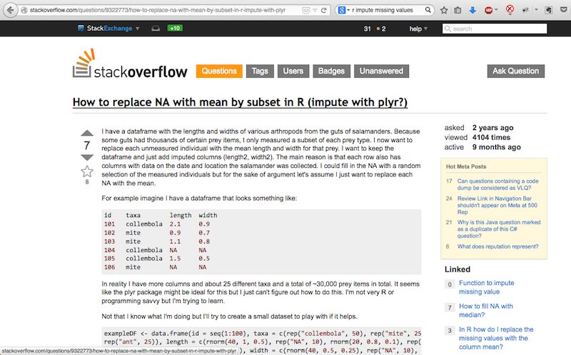

## Kursupplägg

> - Vad är R?
> - Läsa in data i R
> - Undersöka data
> - Visualisering
> - Datamanipulering
> - Funktioner
> - Modellering
> - Vidare läsning

<div class="notes">

### Schema

- 14.00-14.50: Introduktion; data; programmeringsteori
- 15.00-16.10: Datamanipulering; funktionell programmering
- 16.15-17.00: Presentation; att lära sig mer om R och vidare läsning

</div>

# 1. Vad är R?

## R: Ett programmeringsspråk | Nischat mot statistisk programmering

- Hantering av kvantitativ data
- Scriptspråk likt t.ex. javaScript och Ruby

## Några exempel

```{r}
head( faithful )
```

---

```{r,message=FALSE,fig.align='center'}
library(ggplot2)
ggplot(faithful, aes(x = waiting, y = eruptions, color = waiting)) +
   geom_point() +
   labs(title = "Geyserutbrott, Old Faithful (1990)",
        x = "Tid mellan utbrott (min)", y = "Tid för utbrott (min)")
```

---

```{r}
sapply(faithful, mean)
cor(faithful)
```

# 2. Läsa in data

## Inbyggda dataset

- R har ett stort antal inbyggda dataset
- Vanliga: `mtcars`, `iris`, `faithful`
- Kör `library(help = datasets)` för en fullständig lista

## Skapa data

Vektorer

```{r}
min_vektor <- c(1, 2, 'a')
min_vektor
```

---

Data på tabellform

```{r}
min_data <- data.frame(
   id = 1:10,
   utfall = sample(c('a','b','c','d','e'), 10, replace = TRUE)
   )
head( min_data )
```


## Läsa in egna data i R

Läsa in data från CSV
```{r}
min_surveydata <- read.csv("data/SKL/DataUrval141105.csv", sep = ";")
head( min_surveydata )
```

## Ytterligare dataformat

R stöder möjlighet att läsa in data från många källformat, t.ex.:

- Excelfiler (.xls, .xlsx)
- SAS, SPSS, Stata
- SQL-databaser

# 3. Undersöka data i R

## Data på tabellform: en liten exkurs

- R:s representation av tabelldata heter `data.frame`
- Alla kolumner i en tabell måste vara lika många (kan vara missing-värden)
- Flera andra tabellformat, t.ex. `data.table` och `tbl`, finns tillgängliga via olika R-paket

## Hantering av tabeller

Tabeller kan printas direkt till R:s terminal. Detta är dock, som vi ska se, inte meningsfullt och kan vara direkt skadligt.

Det är betydligt mer praktiskt att använda subsetting-operatorer för åtkomst till delar av tabelldata.

- `$` används för att anropa specifika kolumner
- `[,]` används för att skära tabelldata på __rader__ och __kolumner__
- Skärning med `[,]` kan ske både med direkt uppräkning eller analytiskt

## Skärningar i `data.frame`

Plocka ut en kolumn ur en tabell

```{r}
head( iris$Petal.Width )
```

---

Visa några rader ur en tabell

```{r}
iris[15:20,]
```

---

Visa de rader där "Species"-kolumnens värde är "versicolor"

```{r}
head( iris[iris$Species == "versicolor",] )
```

---

Visa enbart kolumnerna "Species" och "Petal.Width"

```{r}
head( iris[,c("Species", "Petal.Width")] )
```


## Inspection

- Handlar om att __titta__ på data utan närmare analys
- Kan skapa tidiga insikter om data
- Genererar lite metadata
- *Undvik* att printa hela datasetet 
- Använd `View()` för "Excelläge"

## Inspection: några exempel

```{r}
head(min_surveydata, n = 3)
```

```{r}
tail(min_surveydata, n = 2)
```

---

```{r}
str(min_surveydata)
```

## Summarization

- Summera data för att skapa något starkare metadata
- Hitta __missing values__

## Summarization: Några exempel

```{r}
summary(min_vektor)
```

---

```{r}
summary(min_surveydata)
```


## Aggregation

- Tabellarisk och formelstyrd aggregering
- Kraftfullare metoder för att programmatiskt undersöka data
- Genererar starka metadata

## Aggregation: Några exempel

Tabellera en vektor med `table`

```{r}
table(min_surveydata$yr)
```

---

Tabellera flera vektorer i en korstabell

```{r}
head( table(min_surveydata[min_surveydata$yr > 2010,c("country", "yr")]) )
```

---

Formelstyrd aggregering av data

```{r}
head( aggregate(tlv ~ yr, data = min_surveydata, FUN = mean) )
```

---

Linjär modell för data

```{r}
lm(tlv ~ ud, data = min_surveydata)
```


# 4. Visualisering

## `ggplot2`: Den nya standarden

- Bygger på __Grammar of Graphics__ (Wilkinson, 2005)
- En canvas för datadriven grafik
- Använder sig av former, `geoms`, för att rita grafik baserat på data

## `ggplot2`: En bred verktygslåda

- `geom_point()`: scatterplot
- `geom_bar()`/`geom_histogram()`: Historgram
- `geom_line()`: Linjediagram
- etc...

## `ggplot2`: Några exempel

```{r, fig.align='center', warning=FALSE}
library(ggplot2)
min_plot <- ggplot(min_surveydata, aes(x = accu, y = tlv, color = country)) +
   geom_point()
### <b>
min_plot
### </b>
```

---

```{r, fig.align='center', warning=FALSE}
plotdata <- min_surveydata[
   min_surveydata$country %in% c("Sweden", "Germany", "Finland", "United States"),]
### <b>
ggplot(plotdata, aes(x = yr, y = u, color = country)) +
   geom_line() +
   labs(x = "År", u = "u", color = "Land",
        title = "U för Sverige och några jämförelseländer")
### </b>
```

# 5. Datamanipulering

## Tilldelning (assignment)

Assignment innebär att tillordna någon data eller funktionalitet till en variabel.

Assignment i R görs med operatorn `<-`. Även operatorn `=` kan användas, men konventionen föreskriver att denna främst ska användas då __parametrar__ anges vid __funktionsanrop__ (mer om detta strax).

---

```{r}
min_vektor <- min_surveydata$yr
```

I ett parameteranrop innebär `=` att inget värde sparas för variabelnamnet

```{r}
mean(x = min_vektor)
```


## Feature Engineering

Koda nya variabler utifrån befintlig data

```{r}
min_surveydata$high_u <- min_surveydata$u > 8
min_surveydata$dec <- (min_surveydata$yr %/% 10) * 10
head(min_surveydata)
```

---

Skapa index från flera variabler

```{r}
min_surveydata$index <-
   with(min_surveydata,
        ud * 0.2 + u * 0.1 + tlv * 0.7)
```


## Missing values

```{r}
sum(c(1,2))
sum(c(1,2,NA))
```

- Representeras i R nästan alltid som `NA`
- Kan skapa en massa oreda


## Transformationer

- Flera tillgängliga approacher för att transformera data
- Paketen `plyr`, `dplyr`, `reshape2` och `tidyr` några av favoriterna
- Lär dig ett och håll dig till det i början

## Transformationer: Exempel med `tidyr`

```{r}
library(tidyr)
ts_data <- min_surveydata[,c("country","yr","u")]
### <b>
wide_data <- spread(ts_data, key = yr, value = u)
### </b>
head(wide_data)
```

---

```{r}
### <b>
long_data <- gather(wide_data, key = yr, value = u, -country)
### </b>
head(long_data)
```

# 6. Funktionell programmering | En kraschkurs

## Vad är en funktion?

- Allt som skrivs med en parentes efteråt
- Ex: `sum(x)`, `lm(tlv ~ ud, data = min_surveydata)`

## Skriva egna funktioner

```{r}
kvadrat <- function(x) {
   return(x^2)
}
kvadrat(2)
kvadrat(c(-1, 18))
```

## Varför funktioner?

- Återvinning av kod gör koden mer lättläst, kortare, mer logiskt strukturerad
- Förvaltningsbarhet och kommunikativitet

# 7. Modeller

## Modeller i R: mer information, fler verktyg

- R stöder i stort sett vilken typ statistisk modellering som helst
- Viktigt att förstå R:s `formula`-gränssnitt (`~`)
- För att få ut rik information ur modeller behövs ofta flera olika verktyg

## Exempel: Linjär regression

Formulera modellen med `lm()` (__Linear Model__)

```{r}
min_modell <- lm(u ~ ud + tlv, data = min_surveydata)
```

---

Undersök resultatet

```{r}
summary(min_modell)
```

---

ANOVA

```{r}
anova(min_modell)
```

---

Modellen sparar alla data

```{r}
names(min_modell)
```

```{r}
min_modell$call
```

## Exempel: Logistisk regression

Logistisk regression genomförs med funktionen `glm()` (__Generalized Linear Model__).

Den viktigaste skillnaden mot `lm()` är att parametern __family__ anger vilken typ av utfallsmått modellen ska predicera på.

```{r}
logistisk_modell <- glm(high_u ~ tlv + ud + nrrFam + country,
                        family = binomial(logit), data = min_surveydata)
```

## Modelltester

- Tester av modellen genomförs separat från modellen
- Funktioner för olika tester heter ofta [namn].test
- Ex: `t.test()`, `ks.test()`, `chisq.test()`, `prop.test()`

## Modelltester: Några exempel

T-test

```{r}
t.test(ud ~ high_u, alternative = "two.sided", data = min_surveydata)
```

---

Korrelation med Pearson's __r__

```{r}
cor.test( ~ ud + u, data = min_surveydata)
```

---

Kolmogorov-Smirnov-test

```{r}
# Är variabeln U gammafördelad med shape 3, rate 2?
ks.test(min_surveydata$u+2, "pgamma", 3, 2)
```

# 8. Vidare läsning

## Kunskapsresurser

- Lär dig googla!
- Stack Overflow: den bästa lärare du kunnat ha

## { .flexbox .vcenter }



## R-kurser

- Måns Magnusson
- Coursera
- Datacamp

## Litteratur

- Advanced R Programming (Hadley Wickham)
- R For Stata/SPSS/SAS Users (Robert Muenchen)

## Tack! { .flexbox .vcenter }

### Frågor?

love.hansson@gmail.com

http://lchansson.com/